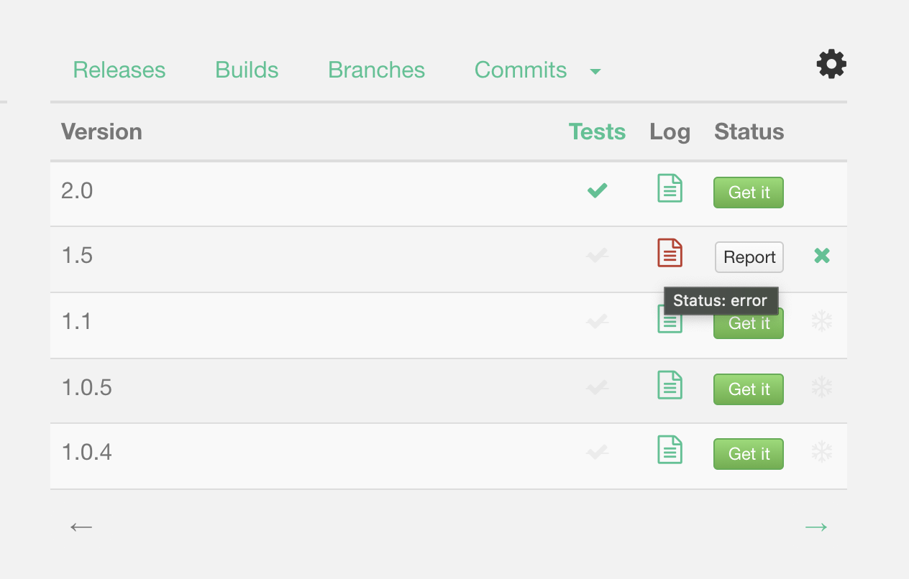

# Guide to publishing libraries

In order to publish your library on JitPack you just need a working build file in your Git repository.

JitPack currently can build **Gradle**, **Maven**, **Sbt** and **Leiningen** projects. Let us know if you want to use it with other build tools.

If the project has a `build.gradle` file then it will be built using Gradle otherwise JitPack will look for a `pom.xml`, `build.sbt` or `project.clj` file. The `build.gradle` file can also be located in a subfolder.

## Gradle projects

Projects using Gradle need to have either the [`maven`](http://gradle.org/docs/current/userguide/maven_plugin.html) or [`maven-publish`](https://gradle.org/docs/current/userguide/publishing_maven.html) plugin enabled. For example, if you add this to your build file:

```gradle
apply plugin: 'maven'
    
group = 'com.github.YourUsername'
```

then JitPack will run:

```sh
./gradlew install
```

to install the jar and pom file in it's local maven repository. With `maven-publish` plugin it will run
```sh
./gradlew build publishToMavenLocal
```

Note that if your project isn't using a Gradle wrapper JitPack will build it with a recent version of Gradle. Therefore it is recommended to use the wrapper.

### Example projects

 - Simple - https://github.com/jitpack/gradle-simple
 - Multiple modules - https://github.com/jitpack/gradle-modular
 - Project with multiple artifacts - https://github.com/jitpack/gradle-multiple-jars

## Android projects

See the [Guide to publishing Android libraries](ANDROID.md) with Gradle

## Maven projects

JitPack will run: 
```sh
mvn install -DskipTests
```
    
to build and publish Maven projects. 
Your Maven group id is harvested from the top-level pom and then used to locate the installed artifacts in `~/.m2/repository`. Binary jars, source jars and javadoc can all be picked up from there via the JitPack virtual repository.

If your project requires a specific Maven version then you can use the [Maven Wrapper](https://github.com/takari/maven-wrapper). In that case JitPack will run:
```sh
./mvnw install -DskipTests
```

### Example projects

 - Simple - https://github.com/jitpack/maven-simple

 - Multiple modules - https://github.com/jitpack/maven-modular
  
# Multi-module projects

If the project builds multiple modules JitPack publish all of them. It will also generate a module that includes all of repository's modules as dependencies. That way if you don't know which module you want you can get all of them by adding just a single dependency to your build file.

To get individual artifacts of multi-module builds use `com.github.User.Repo` as group Id and `ModuleName` as the artifact Id.

Individual module in Gradle:

```gradle
implementation 'com.github.User.Repo:Module:Tag'
```
or in Maven:

```xml
<dependency> 
    <groupId>com.github.User.Repo</groupId> 
    <artifactId>Module</artifactId> 
    <version>Tag</version> 
</dependency>
``` 
**Tip**: You can see a list of modules on [jitpack.io](https://jitpack.io) if you Look Up your repository.

To get all modules of a project use the standard syntax:
```gradle
implementation 'com.github.User:Repo:Tag'
```
**Note**: 
If your project only has a *single* module then the dependency for that module is just `com.github.User:Repo:Tag`.

Examples:

 - Multiple Gradle modules - https://github.com/jitpack/gradle-modular

 - Multiple Maven modules - https://github.com/jitpack/maven-modular
 
 N.B. in a Maven multi-module build, the top level is always a pom (not a jar), but it *can* still be used to aggregate javadocs, as long as they are published as a jar file when the project is built. You can configure the javadoc plugin at the top level like this, and the javadocs will be published with an artifact id the same as the top level pom:
 
```xml
<build>
    <pluginManagement>
        <plugins>
            <plugin>
                <artifactId>maven-javadoc-plugin</artifactId>
                <inherited>false</inherited>
                <configuration>
                    <aggregate>true</aggregate>
                </configuration>
                <executions>
                    <execution>
                        <id>aggregate</id>
                        <goals>
                            <goal>aggregate-jar</goal>
                        </goals>
                        <phase>package</phase>
                    </execution>
                </executions>
            </plugin>
        </plugins>
    </pluginManagement>
</build>
```

## Sbt projects

JitPack can build sbt projects and also provide dependencies to sbt. 
When building an Sbt project JitPack will run:
```sh
sbt publishM2
```

To use JitPack repository from sbt add this to build.sbt:
```sbt
resolvers += "jitpack" at "https://jitpack.io"
```
and then use:
```sbt
libraryDependencies += "com.github.User" % "Repo" % "Tag"
```

JitPack also supports cross-building with the %% syntax:
```sbt
libraryDependencies += "com.github.User" %% "Repo" % "Tag"
```
which will build the dependency with your current Scala version by calling `sbt ++SCALA_VERSION`.

## Leiningen projects

When building a Leiningen project JitPack will run:
```
lein do clean, install
```
    
To use JitPack from Leiningen add the repository to your project.clj:
```clojure    
:repositories [["jitpack" "https://jitpack.io"]]
```

and then the dependency:
```clojure
:dependencies [[com.github.User/Repo "Tag"]]
```

# Build environment

Each build will have these environment variables:

- `JITPACK=true`

- `JAVA_HOME=<detected java home>`

- `GIT_COMMIT=<commit at which we're building>`

- `GIT_BRANCH=<current branch>`

- `GIT_DESCRIBE=<output of git describe command>`

And the following project specific environment variables:

- `GROUP=<group id>` # com.github.USER

- `ARTIFACT=<artifact id>` # Git Repository name 

- `VERSION=<version being built>` # A tag or commit

# Custom commands

You can create a `jitpack.yml` file in the root of your repository and override the build commands:

```yml
jdk:
  - openjdk9
before_install:
   - ./custom_setup.sh
install:
   - echo "Running a custom install command"
   - ./gradlew clean install -xtest
env:
   MYVAR: "custom environment variable"
```

The `install` command is expected to create build artifacts somewhere in the project's directory and
*also* to copy them to the local Maven repository `~/.m2/repository`.

## Environment variables

Custom environment variables can be set using the `env` section as key-value pairs. They will be available to your build on JitPack.

Additionally, you can configure environment variables in the Web UI on https://jitpack.io if you have a private repository. Look up your repository and click settings. This is useful if you don't want to store environment variables in git.

## Java version

JitPack will compile projects using OpenJDK Java 8. See the example projects on how to set a different target version in your build file. 

Maven projects that specify a target version in their pom will be built with that target version.

If your project uses Travis or Circle CI then JitPack will read the lowest jdk version from yml file and use that to build.

Alternatively create a `jitpack.yml` file in the root of your repository and specify a jdk version:
```yml
jdk:
  - openjdk9
```

If your project requires a specific Java version then you can use [SDKMAN](https://sdkman.io) in `jitpack.yml`:
```yml
before_install:
   - sdk install java 11.0.10-open
   - sdk use java 11.0.10-open
```

# Troubleshooting

If there is an issue with a build you will see a link to the log in the Status column. 

   

You can also inspect the build log using the URL:

```
https://jitpack.io/com/github/User/Repo/Tag/build.log
```

and browse the files:

```
https://jitpack.io/com/github/User/Repo/Tag/
```

Although we monitor builds feel free to get in touch any time you face an issue or click the Report button. 
The easiest way is to open a GitHub issues or send a Support ticket from https://jitpack.io

## Building ahead of time

You can also build snapshots on each commit if you add GitHub or Bitbucket Webhooks. 

On GitHub go to repository Settings -> Webhooks & Services -> Add webhook.

Webhook URL:
`https://jitpack.io/api/webhooks`

Content type:
`application/json`

The webhook will trigger a build for branches that you have previously used with JitPack. So make sure you have requested `master-SNAPSHOT` from JitPack before adding a webhook.

## Rebuilding

You can remove builds that didn't succeed if you *Sign In* on [JitPack.io](https://jitpack.io) and look up your repository. Requesting them again will result in the project being rebuilt.

You may need to run gradle with `--refresh-dependencies` flag in order to re-fetch the dependency. In maven use the `-U` flag.

## Clean gradle cache

To clean the Gradle cache delete the `HOME_DIR/.gradle/caches` directory.

