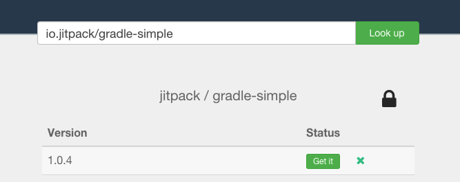

# Private Repositories

JitPack supports building and installing from private Git repositories. Build artifacts are also kept private and you can only download them if you have access to the Git repository itself. 

You can also share your build artifacts (jar, aar) publicly while keeping the source code private. For example, you can easily distribute your library to your users without giving them access to code.

A JitPack Subscription is tied to a specific GitHub/Bitbucket account which can be either a user or an organization. All repositories under that account can be built with JitPack and used by members of the organization.

Note that your GitHub organization may need to approve JitPack in order to access private repositories ([Documentation](https://help.github.com/articles/connecting-with-third-party-applications/#third-party-applications-and-organizations)).

## Set up

To start using private repositories you will first need to grant JitPack access. Open [https://jitpack.io/private](https://jitpack.io/private#auth) and follow the steps:

1. Click Authorize to get your personal authentication token. Each member of your team needs to get their own token.

2. Order your JitPack Account [here](https://jitpack.io/private#subscribe). 

3. Add the token to $HOME/.gradle/gradle.properties:
    - `authToken=AUTHENTICATION_TOKEN`
	
    - For Maven add the token to 	$HOME/.m2/settings.xml :

```xml
<settings>
  <servers>
        <server>
          <id>jitpack.io</id>
          <username>AUTHENTICATION_TOKEN</username>
          <password>.</password>
        </server>
  </servers>
</settings>
```

The id of the server must be the same you use in your pom.xml for JitPack.io.

### Sbt setup

Create a new file $HOME/.sbt/.credentials and insert your authentication token:
```
realm=JitPack
host=jitpack.io
user=AUTHENTICATION_TOKEN
password=.
```

Then add this line to your build.sbt:
```sbt
credentials += Credentials(Path.userHome / ".sbt" / ".credentials")
```

Note that the `realm` property in the credentials file is case sensitive and needs to be exactly `JitPack`.

### Leiningen

Add the token to project.clj as the username:
```
  :repositories [["jitpack" {:url"https://jitpack.io" :username "AUTHENTICATION_TOKEN" :password "."  } ]]
```

### Bitbucket

Create a Team in Bitbucket and generate an API key under the team's [admin page](img/bitbucket-apikey.png). 
Use the API key as an authentication token.


## Usage

Once you are set up you can try installing one of your private repositories:

1. Go to [https://jitpack.io/private](https://jitpack.io/private) and 'Look up' your private repository.

2. Follow the instructions and add credentials to your build file if using Gradle:

```gradle
repositories {
	maven {
		url "https://jitpack.io"
		credentials { username authToken }
	}
}
```

Then add the dependency to your private repository just like you do with a public one:

```gradle
dependencies {
	compile 'com.github.User:PrivateRepo:Tag'
}
```

## Private dependencies

Your private GitHub projects can have dependencies on other GitHub projects. JitPack supports resolution of these dependencies seamlessly and there's no extra configuration required. The token you use to build the first project will also be used to build it's dependencies.

## Permissions

Private repository builds are accessible to you and anyone who has Read permissions for the Git repository itself. For example, you may trigger a build of your library and your colleague will be able to install the library straight away.

Your private repository source code remains private.

## Artifact sharing

There are two ways to share your build artifacts - public and private.

### Artifact sharing publicly

In some cases you want to distribute your project publicly while keeping the source private. In this case:

1. Sign In on JitPack.io homepage
2. Look up your private repository
3. Click on the Lock icon to make the builds public:

   

Once the Lock icon turns to unlocked the project's build artifacts become public. That means your users will be able to install your library without needing an authentication token.

### Artifact sharing privately

Anyone with read access to your Git repo can already download the build artifacts.
You can also add additional collaborators on JitPack.io that will have read access to the build artifacts. They will not have access to the source code.

To add collaborators:

1. Sign In on JitPack.io homepage
2. Look up your private repository
3. Click on settings
4. Add the collaborators GitHub username

Collaborators will need to sign in on JitPack.io to get their own authentication token. 

## Custom domain

If your organisation's GitHub url is https://github.com/yourcompany then by default the groupId of your artifacts will be 'com.github.yourcompany'. If you want to use your own domain name as groupId, you can.

JitPack supports mapping your domain name to your GitHub organization. Then instead of 'com.github.yourcompany' groupId you can use 'com.yourcompany' while the name of the project and version remains the same. 

To enable your own domain name:  

  1. Add a DNS TXT record that maps git.yourcompany.com to https://github.com/yourcompany  

  2. Go to https://jitpack.io/#com.yourcompany/yourrepo and click Look up. If DNS resolution worked then you should see a list of versions.   

  3. Select the version you want and click 'Get it' to see Maven/Gradle instructions.  

Example: [https://jitpack.io/#io.jitpack/gradle-simple](https://jitpack.io/#io.jitpack/gradle-simple)

To check that the DNS TXT record was added run the command `dig txt git.yourcompany.com`. For example:

```
> dig txt git.jitpack.io
...
;; ANSWER SECTION:
git.jitpack.io.		600	IN	TXT	"https://github.com/jitpack"
```
